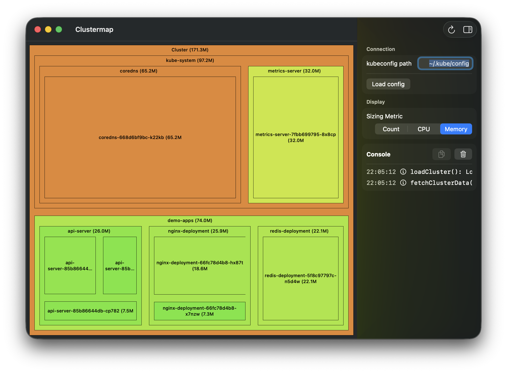

# Clustermap

A native macOS application that visualizes Kubernetes cluster resources using interactive treemaps. Built with SwiftUI, Clustermap provides an intuitive way to understand resource allocation, usage patterns, and cluster topology at a glance.



## Features

- **Interactive Treemap Visualization**: Navigate cluster resources with zoomable, hierarchical treemaps
- **Multiple Sizing Metrics**: View resources by count, CPU usage, or memory consumption  
- **Real-time Resource Monitoring**: Connect to live clusters and fetch current resource metrics
- **Native macOS Experience**: Built with SwiftUI for optimal performance and system integration
- **Kubeconfig Support**: Works with standard Kubernetes configuration files
- **Detailed Inspection**: Side panel with detailed resource information and logs

## Prerequisites

- macOS 13.0 or later
- Xcode 15.0 or later (for building from source)
- Access to a Kubernetes cluster with a valid kubeconfig file
- Kubernetes Metrics Server deployed (for CPU/memory metrics)

## Installation

### Option 1: Build from Source

1. Clone the repository:
   ```bash
   git clone https://github.com/nvictor/clustermap.git
   cd clustermap
   ```

2. Open the project in Xcode:
   ```bash
   open Clustermap/Clustermap.xcodeproj
   ```

3. Build and run the project in Xcode (⌘R)

### Option 2: Use Build Script

```bash
./sh/build.sh
```

## Usage

### Getting Started

1. **Launch Clustermap** - The app will automatically attempt to load your default kubeconfig
2. **Configure Cluster Access** - Use the inspector panel to specify a custom kubeconfig path if needed
3. **Choose Visualization Mode** - Select between Count, CPU, or Memory metrics using the dropdown
4. **Explore Your Cluster** - Click on treemap sections to zoom in, double-click empty space to zoom out

### Visualization Modes

- **Count**: Shows the number of pods/containers in each namespace and deployment
- **CPU**: Visualizes CPU resource requests and usage (requires metrics-server)
- **Memory**: Displays memory resource allocation and consumption (requires metrics-server)

### Navigation

- **Single Click**: Zoom into a namespace or deployment
- **Double Click (empty space)**: Zoom out to parent level
- **Hover**: Highlight sections and show tooltips
- **Inspector Panel**: View detailed logs and resource information

### Kubeconfig Setup

Clustermap supports standard kubeconfig files. By default, it looks for:
- `~/.kube/config`

You can specify a custom path in the inspector panel.

## Architecture

Clustermap follows a clean MVVM architecture:

- **Models**: Kubernetes resource definitions and cluster snapshots
- **ViewModels**: Business logic and state management 
- **Views**: SwiftUI-based treemap visualization and UI components
- **Services**: Kubernetes API client and data fetching logic

For detailed architecture information, see [DESIGN.md](DESIGN.md).

## Development

### Dependencies

- **Yams**: YAML parsing for kubeconfig files
- **SwiftUI**: Native UI framework
- **Foundation**: Core networking and data handling

### Building

Use the provided build script:
```bash
./sh/build.sh
```

Or build directly with Xcode:
```bash
xcodebuild -scheme Clustermap -project Clustermap/Clustermap.xcodeproj
```
